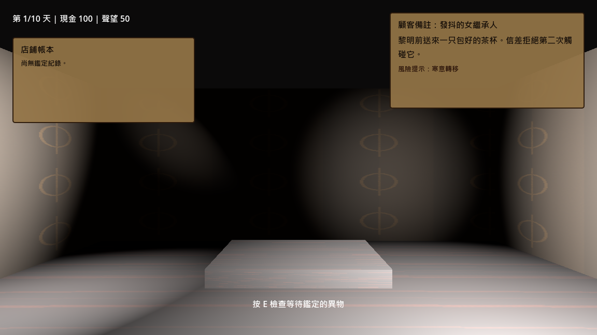
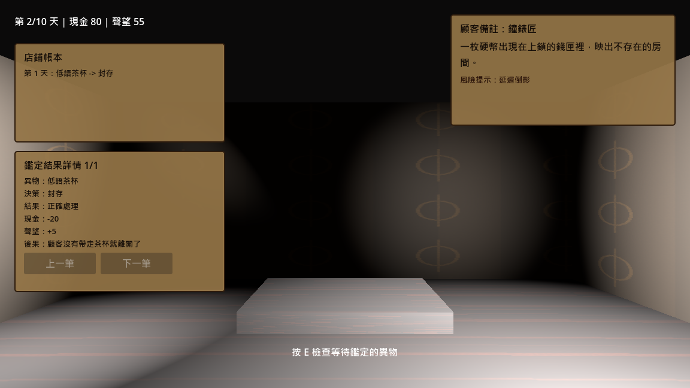
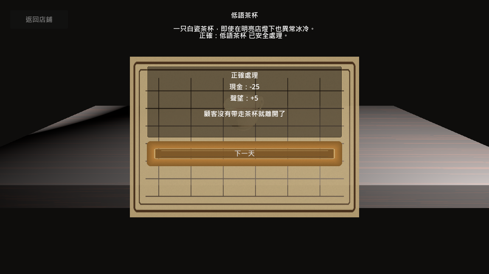
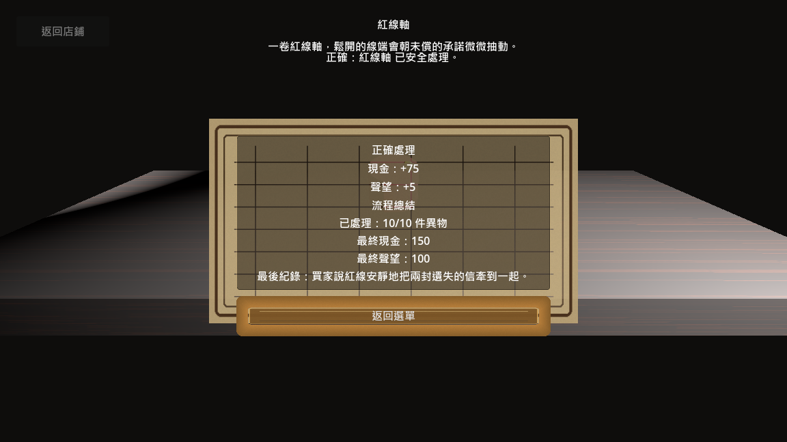
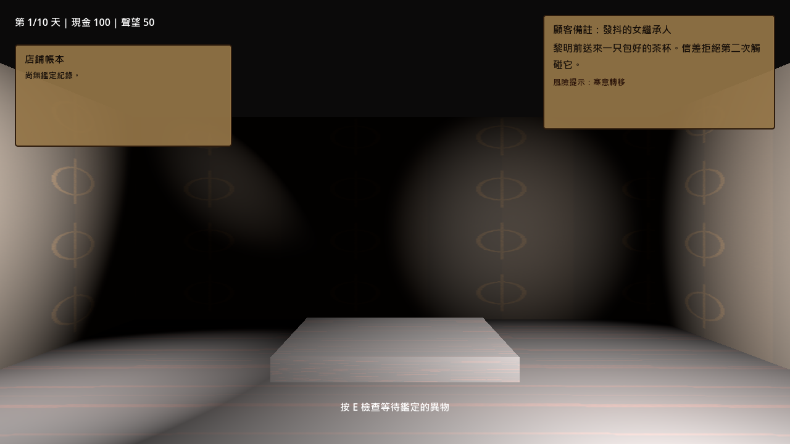
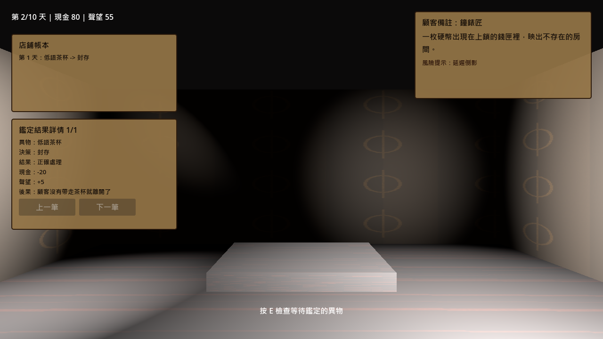
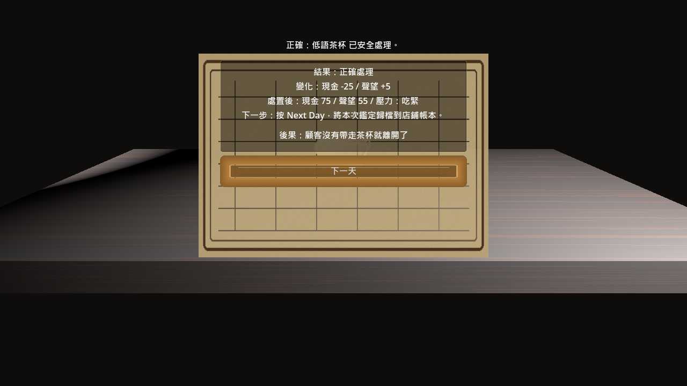
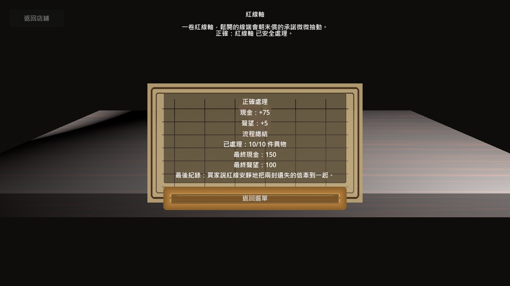

# 繁體中文視覺檢查紀錄

日期：2026-05-25
執行者：Codex
範圍：繁體中文 UI、十日流程、Windows 匯出前檢查

## 驗證指令

```powershell
python -m tools.project_status --root . --run-tests
godot --headless --path godot --script res://tools/smoke_three_day_flow.gd
godot --path godot --script res://tools/capture_traditional_chinese_review.gd
```

截圖指令必須使用非 headless Godot；headless renderer 無法提供可用的 viewport texture。

## 檢查尺寸

- `1152x648`：接近 Codex/Godot debug 視窗常用比例。
- `1280x720`：標準 16:9 檢查比例。
- 檢查狀態：顧客備註、鑑定結果詳情、日結算結果、最終流程總結。

## 截圖










## 結果

- 通過：店鋪顧客備註與店鋪帳本在兩個檢查尺寸都沒有文字超框。
- 通過：鑑定結果詳情的異物、決策、現金、聲望、後果欄位可讀，按鈕沒有遮住文字。
- 通過：日結算結果維持在中央 ledger 框內，文字沒有壓到按鈕。
- 通過：十天最終流程總結在 `1152x648` 與 `1280x720` 都沒有文字超框或按鈕遮住文字，並正確顯示 `10/10` 與紅線軸結果。
- 通過：返回選單按鈕維持在面板底部安全區，與摘要文字保持間距。

## 下一步

十日 MVP 佇列已完整納入可玩流程。下一個建議切片是做完整十日平衡 playtest，檢查現金、聲望、線索可讀性與每一天的決策難度，再決定是否進入新奇物批次或店鋪成長系統。
